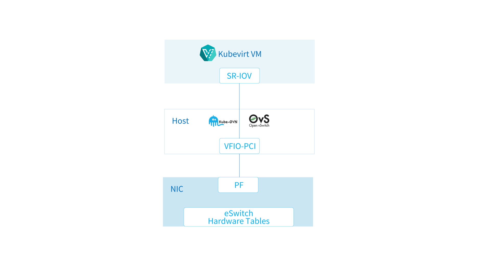

# Mellanox 网卡 Offload 支持

Kube-OVN 在最终的数据平面使用 OVS 来完成流量转发，相关的流表匹配，隧道封装等功能为 CPU 密集型，在大流量下会消耗大量 CPU 资源并导致
延迟上升和吞吐量下降。Mellanox 的 Accelerated Switching And Packet Processing (ASAP²) 技术可以将 OVS 相关的操作卸载到硬件网卡内的
eSwitch 上执行。该技术可以在无需对 OVS 控制平面进行修改的情况下，缩短数据路径，避免对主机 CPU 资源的使用，大幅降低延迟并显著提升吞吐量。



## 前置条件
- Mellanox CX5/CX6/Bluefiled 等支持 ASAP² 的硬件网卡。
- CentOS 8 Stream 或上游 Linux 5.7 以上内核支持。
- 由于当前网卡不支持 `dp_hash` 和 `hash` 操作卸载，需关闭 OVN LB 功能。
- 为了支持卸载模式，网卡不能做 bond。

## 设置网卡 SR-IOV 模式

查询网卡的设备 ID，下面的例子中为 `42:00.0`

```bash
# lspci -nn | grep ConnectX-5
42:00.0 Ethernet controller [0200]: Mellanox Technologies MT27800 Family [ConnectX-5] [15b3:1017]
```

根据设备 ID 找到对应网卡：

```bash
# ls -l /sys/class/net/ | grep 42:00.0
lrwxrwxrwx. 1 root root 0 Jul 22 23:16 p4p1 -> ../../devices/pci0000:40/0000:40:02.0/0000:42:00.0/net/p4p1
```

检查可用 VF 数量：

```bash
# cat /sys/class/net/p4p1/device/sriov_totalvfs
8
```

创建 VF，总数不要超过上面查询出的数量：

```bash
# echo '4' > /sys/class/net/p4p1/device/sriov_numvfs
# ip link show p4p1
10: p4p1: <NO-CARRIER,BROADCAST,MULTICAST,UP> mtu 1500 qdisc mq state DOWN mode DEFAULT group default qlen 1000
    link/ether b8:59:9f:c1:ec:12 brd ff:ff:ff:ff:ff:ff
    vf 0 MAC 00:00:00:00:00:00, spoof checking off, link-state auto, trust off, query_rss off
    vf 1 MAC 00:00:00:00:00:00, spoof checking off, link-state auto, trust off, query_rss off
    vf 2 MAC 00:00:00:00:00:00, spoof checking off, link-state auto, trust off, query_rss off
    vf 3 MAC 00:00:00:00:00:00, spoof checking off, link-state auto, trust off, query_rss off
# ip link set p4p1 up
```

找到上述 VF 对应的设备 ID：
```bash
# lspci -nn | grep ConnectX-5
42:00.0 Ethernet controller [0200]: Mellanox Technologies MT27800 Family [ConnectX-5] [15b3:1017]
42:00.1 Ethernet controller [0200]: Mellanox Technologies MT27800 Family [ConnectX-5] [15b3:1017]
42:00.2 Ethernet controller [0200]: Mellanox Technologies MT27800 Family [ConnectX-5 Virtual Function] [15b3:1018]
42:00.3 Ethernet controller [0200]: Mellanox Technologies MT27800 Family [ConnectX-5 Virtual Function] [15b3:1018]
42:00.4 Ethernet controller [0200]: Mellanox Technologies MT27800 Family [ConnectX-5 Virtual Function] [15b3:1018]
42:00.5 Ethernet controller [0200]: Mellanox Technologies MT27800 Family [ConnectX-5 Virtual Function] [15b3:1018]
```

将 VF 从驱动中解绑：

```bash
echo 0000:42:00.2 > /sys/bus/pci/drivers/mlx5_core/unbind
echo 0000:42:00.3 > /sys/bus/pci/drivers/mlx5_core/unbind
echo 0000:42:00.4 > /sys/bus/pci/drivers/mlx5_core/unbind
echo 0000:42:00.5 > /sys/bus/pci/drivers/mlx5_core/unbind
```

开启 eSwitch 模式，并设置硬件卸载：

```bash
devlink dev eswitch set pci/0000:42:00.0 mode switchdev
ethtool -K enp66s0f0 hw-tc-offload on
```

重新绑定驱动，完成 VF 设置：
```bash
echo 0000:42:00.2 > /sys/bus/pci/drivers/mlx5_core/bind
echo 0000:42:00.3 > /sys/bus/pci/drivers/mlx5_core/bind
echo 0000:42:00.4 > /sys/bus/pci/drivers/mlx5_core/bind
echo 0000:42:00.5 > /sys/bus/pci/drivers/mlx5_core/bind
```

`NetworkManager` 的一些行为可能会导致驱动异常，如果卸载出现问题建议关闭 `NetworkManager` 再进行尝试：
```bash
systemctl stop NetworkManager
systemctl disable NetworkManager
```

## 安装 SR-IOV Device Plugin

由于每个机器的 VF 数量优先，每个使用加速的 Pod 会占用 VF 资源，我们需要使用 SR-IOV Device Plugin 管理相应资源，使得调度器知道如何根据
资源进行调度。

创建 SR-IOV 相关 Configmap：
```yaml
apiVersion: v1
kind: ConfigMap
metadata:
  name: sriovdp-config
  namespace: kube-system
data:
  config.json: |
    {
      "resourceList": [{
          "resourcePrefix": "mellanox.com",
          "resourceName": "cx5_sriov_switchdev",
          "selectors": {
                  "vendors": ["15b3"],
                  "devices": ["1018"],
                  "drivers": ["mlx5_core"]
              }
      }
      ]
    }
```

参考 [SR-IOV 文档](https://github.com/intel/sriov-network-device-plugin)进行部署:

```bash
kubectl apply -f https://raw.githubusercontent.com/intel/sriov-network-device-plugin/master/deployments/k8s-v1.16/sriovdp-daemonset.yaml
```

检查 SR-IOV 资源是否已经注册到 Kubernetes Node 中：

```bash
kubectl describe node kube-ovn-01  | grep mellanox

mellanox.com/cx5_sriov_switchdev:  4
mellanox.com/cx5_sriov_switchdev:  4
mellanox.com/cx5_sriov_switchdev  0           0
```

## 安装 Multus-CNI

SR-IOV Device Plugin 调度时获得的设备 ID 需要通过 Multus-CNI 传递给 Kube-OVN，因此需要配置 Multus-CNI 配合完成相关任务。

参考 [Multius-CNI 文档](https://github.com/k8snetworkplumbingwg/multus-cni)进行部署：

```bash
kubectl apply -f https://raw.githubusercontent.com/k8snetworkplumbingwg/multus-cni/master/deployments/multus-daemonset.yml
```

创建 `NetworkAttachmentDefinition`：

```yaml
apiVersion: "k8s.cni.cncf.io/v1"
kind: NetworkAttachmentDefinition
metadata:
  name: default
  namespace: default
  annotations:
    k8s.v1.cni.cncf.io/resourceName: mellanox.com/cx5_sriov_switchdev
spec:
  config: '{
    "cniVersion": "0.3.1",
    "name": "kube-ovn",
    "plugins":[
        {
            "type":"kube-ovn",
            "server_socket":"/run/openvswitch/kube-ovn-daemon.sock",
            "provider": "default.default.ovn"
        },
        {
            "type":"portmap",
            "capabilities":{
                "portMappings":true
            }
        }
    ]
}'
```

- `provider`: 格式为当前 `NetworkAttachmentDefinition` 的 {name}.{namespace}.ovn。

## Kube-OVN 中开启卸载模式

下载安装脚本：

```bash
wget https://raw.githubusercontent.com/alauda/kube-ovn/release-1.10/dist/images/install.sh
```

修改相关参数，`IFACE` 需要为物理网卡名，该网卡需要有可路由 IP：
```bash
ENABLE_MIRROR=${ENABLE_MIRROR:-false}
HW_OFFLOAD=${HW_OFFLOAD:-true}
ENABLE_LB=${ENABLE_LB:-false}
IFACE="ensp01"
```

安装 Kube-OVN：

```bash
bash install.sh
```

## 创建使用 VF 网卡的 Pod

可以使用如下 yaml 格式创建使用 VF 进行网络卸载加速的 Pod:

```yaml
apiVersion: v1
kind: Pod
metadata:
  name: nginx
  annotations:
    v1.multus-cni.io/default-network: default/default
spec:
  containers:
  - name: nginx
    image: nginx:alpine
    resources:
      requests:
        mellanox.com/cx5_sriov_switchdev: '1'
      limits:
        mellanox.com/cx5_sriov_switchdev: '1'
```

- `v1.multus-cni.io/default-network`: 为上一步骤中 `NetworkAttachmentDefinition` 的 {namespace}/{name}。


可通过在 Pod 运行节点的 `ovs-ovn` 容器中运行下面的命令观察卸载是否成功：

```bash
# ovs-appctl dpctl/dump-flows -m type=offloaded
ufid:91cc45de-e7e9-4935-8f82-1890430b0f66, skb_priority(0/0),skb_mark(0/0),ct_state(0/0x23),ct_zone(0/0),ct_mark(0/0),ct_label(0/0x1),recirc_id(0),dp_hash(0/0),in_port(5b45c61b307e_h),packet_type(ns=0/0,id=0/0),eth(src=00:00:00:c5:6d:4e,dst=00:00:00:e7:16:ce),eth_type(0x0800),ipv4(src=0.0.0.0/0.0.0.0,dst=0.0.0.0/0.0.0.0,proto=0/0,tos=0/0,ttl=0/0,frag=no), packets:941539, bytes:62142230, used:0.260s, offloaded:yes, dp:tc, actions:54235e5753b8_h
ufid:e00768d7-e652-4d79-8182-3291d852b791, skb_priority(0/0),skb_mark(0/0),ct_state(0/0x23),ct_zone(0/0),ct_mark(0/0),ct_label(0/0x1),recirc_id(0),dp_hash(0/0),in_port(54235e5753b8_h),packet_type(ns=0/0,id=0/0),eth(src=00:00:00:e7:16:ce,dst=00:00:00:c5:6d:4e),eth_type(0x0800),ipv4(src=0.0.0.0/0.0.0.0,dst=0.0.0.0/0.0.0.0,proto=0/0,tos=0/0,ttl=0/0,frag=no), packets:82386659, bytes:115944854173, used:0.260s, offloaded:yes, dp:tc, actions:5b45c61b307e_h
```

如果有 `offloaded:yes, dp:tc` 内容证明卸载成功。
