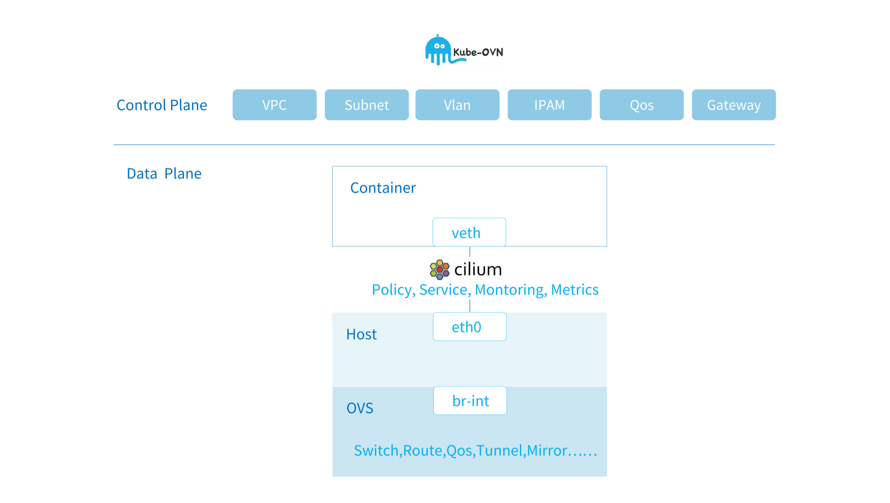

# Cilium 集成

[Cilium](https://cilium.io/) 是一款基于 eBPF 的网络和安全组件，Kube-OVN 利用其中的 
[CNI Chaining](https://docs.cilium.io/en/stable/gettingstarted/cni-chaining/) 模式来对已有功能进行增强。
用户可以同时使用 Kube-OVN 丰富的网络抽象能力和 eBPF 带来的监控和安全能力。

通过集成 Cilium，Kube-OVN 用户可以获得如下增益：

- 更丰富高效的安全策略。
- 基于 Hubble 的监控视图。



## 前提条件

1. Linux 内核版本高于 4.19 或其他兼容内核以获得完整 eBPF 能力支持。
2. 提前部署 Helm 为安装 Cilium 做准备，部署 Helm 请参考 [Installing Helm](https://helm.sh/docs/intro/install/)。

## 配置 Kube-OVN

为了充分使用 Cilium 的安全能力，需要关闭 Kube-OVN 内的 `networkpolicy` 功能，并调整 CNI 配置优先级。

在 `install.sh` 脚本里修改下列变量：

```bash
ENABLE_NP=false
CNI_CONFIG_PRIORITY=10
```

若已部署完成，可通过修改 `kube-ovn-controller` 的启动参数进行调整 `networkpolicy`：

```yaml
args:
- --enable-np=false
```

修改 `kube-ovn-cni` 启动参数调整 CNI 配置优先级：

```yaml
args:
- --cni-conf-name=10-kube-ovn.conflist
```

在每个节点调整 Kube-OVN 配置文件名称，以便优先使用 Cilium 进行操作：

```bash
mv /etc/cni/net.d/01-kube-ovn.conflist /etc/cni/net.d/10-kube-ovn.conflist
```

## 部署 Cilium

创建 `chaining.yaml` 配置文件，使用 Cilium 的 generic-veth 模式：

```yaml
apiVersion: v1
kind: ConfigMap
metadata:
  name: cni-configuration
  namespace: kube-system
data:
  cni-config: |-
    {
      "name": "generic-veth",
      "cniVersion": "0.3.1",
      "plugins": [
        {
          "type": "kube-ovn",
          "server_socket": "/run/openvswitch/kube-ovn-daemon.sock",
          "ipam": {
              "type": "kube-ovn",
              "server_socket": "/run/openvswitch/kube-ovn-daemon.sock"
          }
        },
        {
          "type": "portmap",
          "snat": true,
          "capabilities": {"portMappings": true}
        },
        {
          "type": "cilium-cni"
        }
      ]
    }
```

安装配置文件：

```bash
kubectl apply -f chaining.yaml
```

使用 Helm 部署 Cilium：

```bash
helm repo add cilium https://helm.cilium.io/
helm install cilium cilium/cilium --version 1.11.6 \
    --namespace kube-system \
    --set cni.chainingMode=generic-veth \
    --set cni.customConf=true \
    --set cni.configMap=cni-configuration \
    --set tunnel=disabled \
    --set enableIPv4Masquerade=false \
    --set enableIdentityMark=false 
```

确认 Cilium 安装成功：

```bash
# cilium  status
    /¯¯\
 /¯¯\__/¯¯\    Cilium:         OK
 \__/¯¯\__/    Operator:       OK
 /¯¯\__/¯¯\    Hubble:         disabled
 \__/¯¯\__/    ClusterMesh:    disabled
    \__/

DaemonSet         cilium             Desired: 2, Ready: 2/2, Available: 2/2
Deployment        cilium-operator    Desired: 2, Ready: 2/2, Available: 2/2
Containers:       cilium             Running: 2
                  cilium-operator    Running: 2
Cluster Pods:     8/11 managed by Cilium
Image versions    cilium             quay.io/cilium/cilium:v1.10.5@sha256:0612218e28288db360c63677c09fafa2d17edda4f13867bcabf87056046b33bb: 2
                  cilium-operator    quay.io/cilium/operator-generic:v1.10.5@sha256:2d2f730f219d489ff0702923bf24c0002cd93eb4b47ba344375566202f56d972: 2

```
