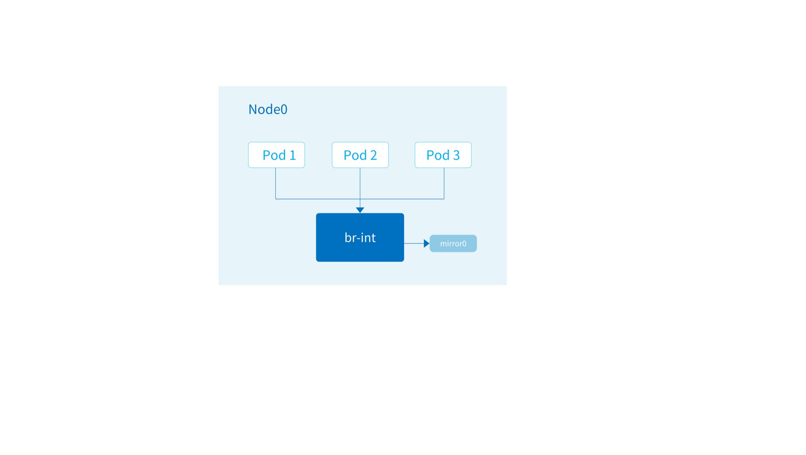

# 流量镜像

流量镜像功能可以将进出容器网络的数据包进行复制到主机的特定网卡。管理员或开发者
可以通过监听这块网卡获得完整的容器网络流量来进一步进行分析，监控，安全审计等操作。

流量镜像功能会带来一定的性能损失，根据 CPU 性能以及流量的特征，会有 5%~10% 的
额外 CPU 消耗。



## 全局流量镜像配置

流量镜像功能默认为关闭状态，如果需要开启请修改 `kube-ovn-cni` DaemonSet 的启动参数：

- `--enable-mirror=true`： 是否开启流量镜像
- `--mirror-iface=mirror0`: 流量镜像所复制到的网卡名。该网卡可为主机上已存在的一块物理网卡，
此时该网卡会被桥接进 br-int 网桥，镜像流量会直接接入底层交换机。若网卡名不存在，Kube-OVN 会自动
创建一块同名的虚拟网卡，管理员或开发者可以在宿主机上通过该网卡获取当前节点所有流量。默认为 `mirror0`

接下来可以用 tcpdump 或其他流量分析工具监听 `mirror0` 上的流量：

```bash
tcpdump -ni mirror0
```

## Pod 级别流量镜像配置

如果只需对部分 Pod 流量进行镜像，则需要关闭全局的流量镜像功能，然后在特定 Pod 上增加
`ovn.kubernetes.io/mirror` annotation 来开启 Pod 级别流量镜像。

```yaml
apiVersion: v1
kind: Pod
metadata:
  name: mirror-pod
  namespace: ls1
  annotations:
    ovn.kubernetes.io/mirror: "true"
spec:
  containers:
  - name: mirror-pod
    image: nginx:alpine
```
