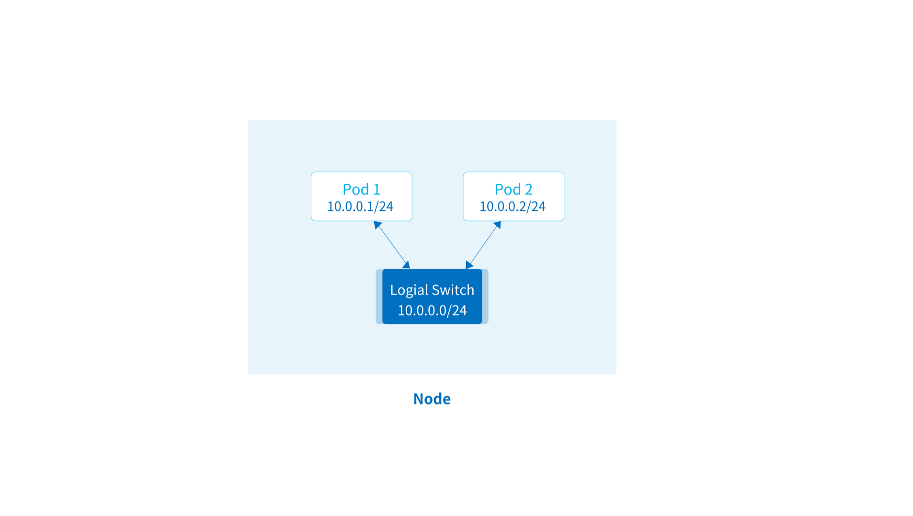
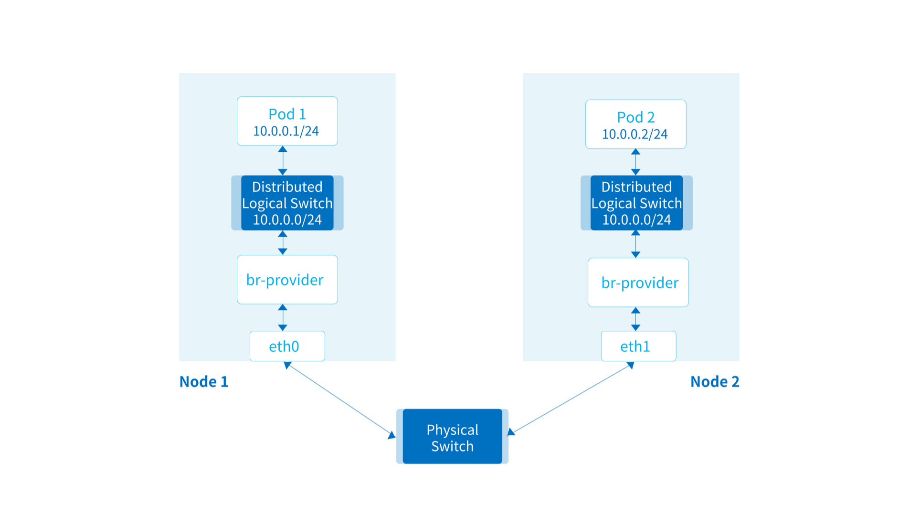
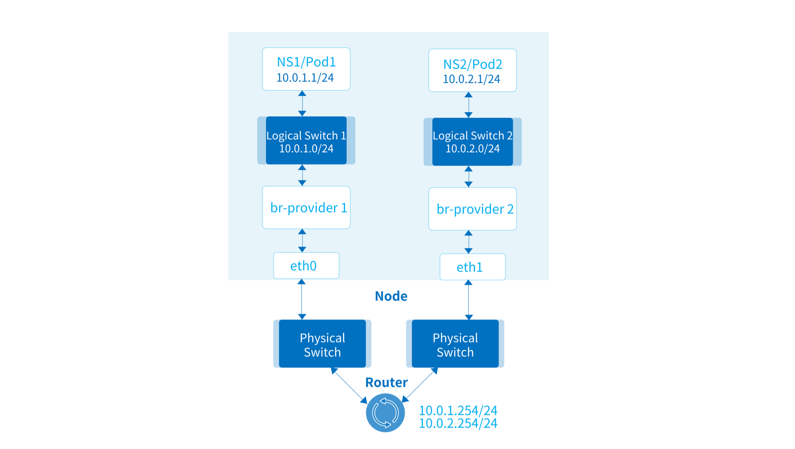
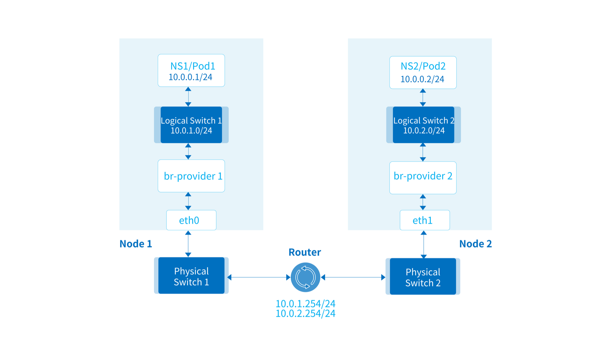
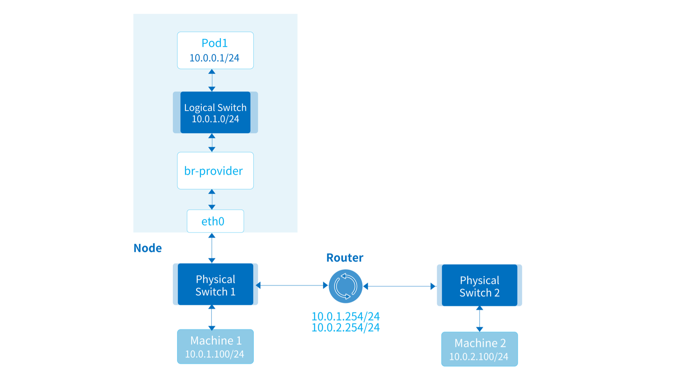
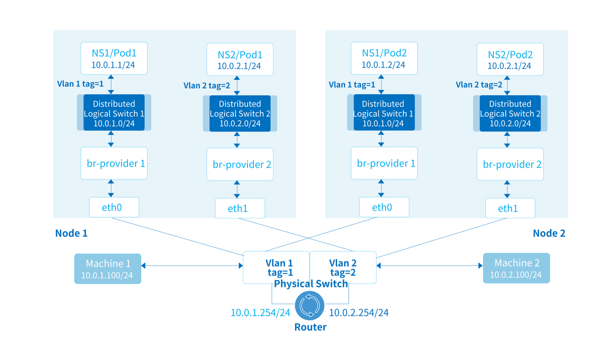

# Underlay Traffic Topology

本文档介绍 Underlay 模式下流量在不同情况下的转发路径。

## 同节点同子网

内部逻辑交换机直接交换数据包，不进入外部网络。

## 跨节点同子网

数据包经由节点网卡进入外部交换机，由外部交换机进行交换。

## 同节点不同子网

数据包经由节点网卡进入外部网络，由外部交换机及路由器进行交换和路由转发。

> 此处 br-provider-1 和 br-provider-2 可以是同一个 OVS 网桥，即多个不同子网可以使用同一个 Provider Network。

## 跨节点不同子网

数据包经由节点网卡进入外部网络，由外部交换机及路由器进行交换和路由转发。

## 访问外部

数据包经由节点网卡进入外部网络，由外部交换机及路由器进行交换和路由转发。

> 节点与 Pod 之间的通信大体上也遵循此逻辑。

## 无 Vlan Tag 下总览

## 多 VLAN 总览

## Pod 访问 Service IP

Kube-OVN 为每个 Kubernetes Service 在每个子网的逻辑交换机上配置了负载均衡。
当 Pod 通过访问 Service IP 访问其它 Pod 时，会构造一个目的地址为 Service IP、目的 MAC 地址为网关 MAC 地址的网络包。
网络包进入逻辑交换机后，负载均衡会对网络包进行拦截和 DNAT 处理，将目的 IP 和端口修改为 Service 对应的某个 Endpoint 的 IP 和端口。
由于逻辑交换机并未修改网络包的二层目的 MAC 地址，网络包在进入外部交换机后仍然会送到外部网关，此时需要外部网关对网络包进行转发。

### Service 后端为同节点同子网 Pod

### Service 后端为同节点不同子网 Pod

